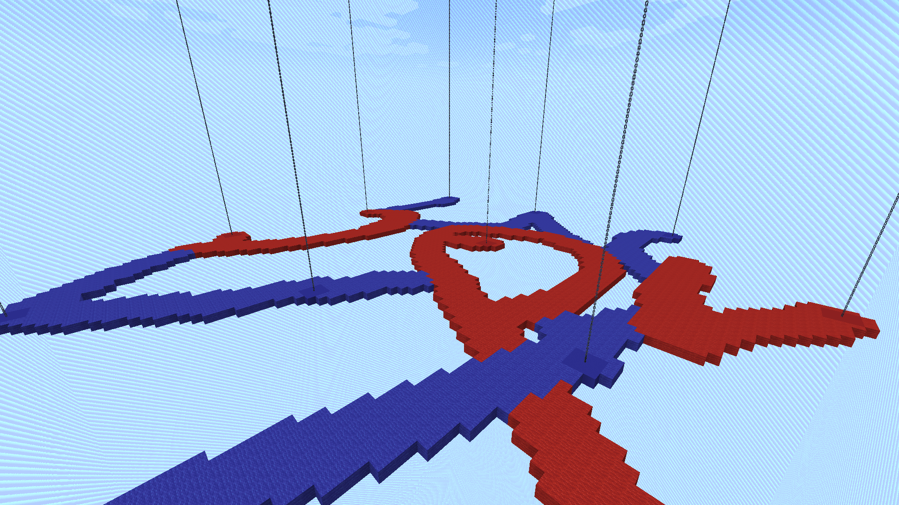

# Void Chains Gallery

The purpose of this gallery is to provide a few screenshots and GIFs from the minigame, demonstrating some features and functionalities. The content shown here is not up-to-date but, nonetheless, should give a good overview. **GIFs may take a few seconds to load.**

## Gameplay

### An example arena during a game

  

### GIF: Land collapsing after no longer being attached to an anchor of the same color

  

### GIF: An anchor being claimed by the opposing team, leading to the destruction of previously supported land

  

### GIF: An anchor being destroyed by the world border, leading to the destruction of previously supported land

  

## Lobby

### The lobby

  

### GIF: An early showcase of the game menu

  

